# SKN13-1st-5TEAM 

2024년 1월 1일 정부는 법인 차량에 대한 세제 혜택 조건을 강화하는 정책을 시행하였다.

본 프로젝트는 연두색 번호판 정책의 **도입 배경** 을 설명하고,

정책의 **효과**, 그리고 **사회적 반응**을 데이터 기반으로 분석하는 것을 목표로 한다.

마지막으로 대부분 궁금해할 질문들을 답변으로 이 프로젝트를 마친다.

---

## 👥 팀원 소개 
팀명 : 연두맛하차감💚

| 이름  | 이미지                                       | 이메일               |
|:------:|:-------------------------------------------:|:--------------------:|
| 김승호 |        | qqqppma@gmail.com    |
| 김지민 |        | kzm0502@naver.com    |
| 변성일 |        | erety4100@naver.com  |
| 장시인 |    | zzangsiin@gmail.com  |
| 장진슬 |        | gpendlr@gmail.com    |

---

# 1. 프로젝트 개요 
   
## 📌 주제 선정 이유
도심에서 자주 보이는 **슈퍼카**, 알고 보면 상당수가 **법인 명의 차량**이다.

>람보르기니, 맥라렌 등 슈퍼카 브랜드 차량의 약 90% 이상이 법인차로 등록되어있다.

>고가 차량을 법인 명의로 구매하면 부가세 환급, 유지비 비용처리, 법인세 절감 등의 혜택을 받을 수 있어 개인이 사적으로 이용하는 경우가 많아졌다.

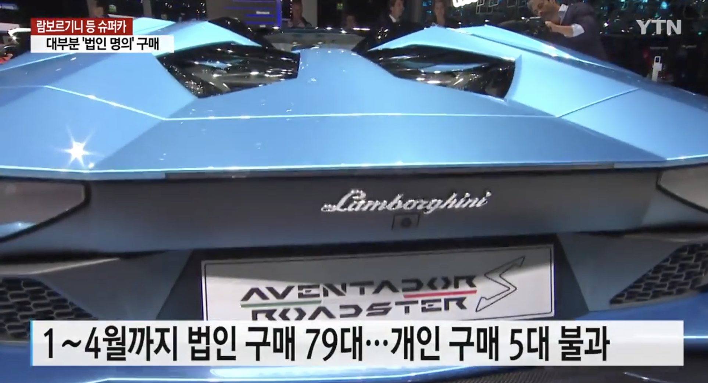

___

## 📘 프로젝트 소개
2024년 1월 1일부터 시행된 **연두색 번호판 정책**을 중심으로, 법인 슈퍼카 판매 변화 추이를 데이터 기반으로 분석한다. 

>고가 법인차의 사적 사용을 막기 위한 정책이 어떤 효과를 냈는지, 대중 반응이 어땠는지를 살펴본다.

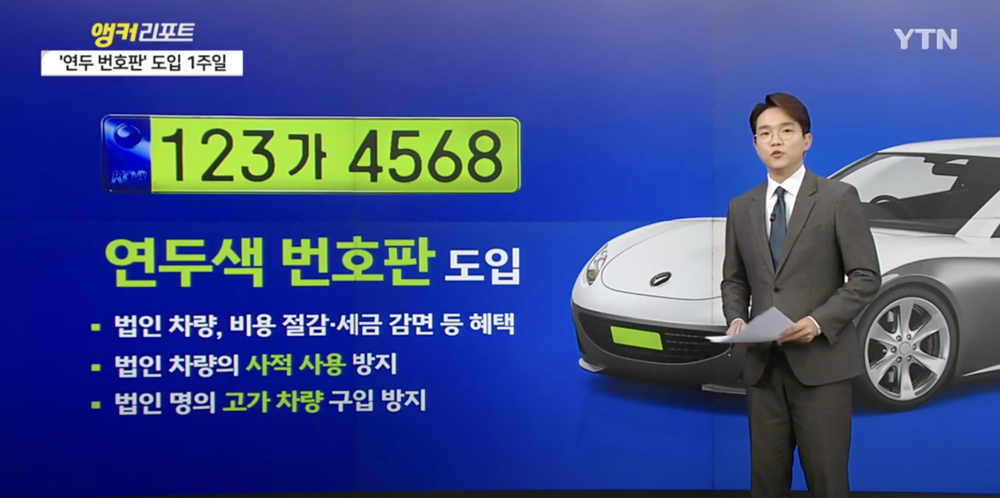

___

## 🧭 프로젝트 필요성
정부는 법인차에 대한 특혜 논란과 탈세 문제를 해결하고자 **8,000만 원 이상 법인차**에 **연두색 번호판** 부착을 의무화했다. 

본 프로젝트는 이 제도의 배경과 영향, 자동차 시장의 변화, 정책 효과를 분석하는 데 목적이 있다.

>이 정책 이후 슈퍼카 브랜드의 법인차 등록이 최대 85%까지 감소하는 등 변화가 나타났다. 

___

### 1. 정책 개요
- 고급 수입차/슈퍼카를 **법인 명의로 등록**하여 **감가상각, 비용처리 등 세금 혜택**을 받는 관행이 문제시됨
- 2024년 1월 1일 **연두색 번호판** 정책 도입으로 법인차 제도 **강화**
- 주요 조치:
  - 감가상각 인정 한도 제한
  - 업무용 사용 기준 강화
  - 부가세 환급 요건 엄격화

### 2. 정책 목적
- 탈세 방지
- 과세 형평성 강화
- 고소득층에 대한 세제 혜택 축소

### 3. 시행 현황
- 2024년 1월 1일부터 본격 시행
- 정책 시행 이후 법인 명의 슈퍼카 등록 및 구매 감소 확인

---

# 2. 프로젝트 

## 2-1. 사용한 기술 스택

  
  

  
  
  

  
  
  
<!--    -->

  

---

## 2-2. WBS
| 작업 명                | 시작일 | 종료일 | 담당자                   | 산출물                   | 의존작업            |
|---------------------|:-------:|:-------:|-----------------------|------------------------|--------------------|
| 프로젝트 주제 선정     | 04-09 | 04-09 | ALL                       | 없음                    | 없음                |
| 웹 크롤링              | 04-09 | 04-09 | ALL                       | CSV 파일, SQL 데이터    | Streamlit 작업       |
| FAQ 크롤링             | 04-09 | 04-09 | 변성일, 장시인, 장진슬      | CSV 파일, SQL 데이터  | Streamlit 작업       |
| ERD 작성               | 04-10 | 04-10 | 변성일, 장시인              | ERD 다이어그램         | 없음                |
| 데이터-DB연동          | 04-10 | 04-10 | 장시인                       | DB 데이터                | 크롤링, 데이터수집     |
| Streamlit 화면 설계    | 04-10 | 04-10 | 김승호, 변성일,             | 설계파일, WEB 화면       | 없음                |
| Streamlit-DB연동       | 04-10 | 04-10 | 김승호, 변성일             | DB 테이블                 | Streamlit 화면       |
| Streamlit 화면 구현    | 04-10 | 04-10 | 김승호, 변성일, 장진슬       | Streamlit 화면      | 크롤링, 데이터수집     |
| 코드 취합              | 04-10 | 04-10 | ALL                       | Web 페이지, DB 데이터     | 크롤링, 데이터수집     |
| README.md 점검 및 작성 | 04-10 | 04-10 | 장진슬                       | github README.md        | Github                     |
| 최종 점검              | 04-10 | 04-10 | ALL                       | 없음                     | 없음                  |

---

## 2-3. 데이터 수집 및 처리 과정

### 📊 데이터 출처
- 국토교통부 차량 등록 통계 - 통계 누리
- DANAWA (다나와 자동차) 수입차 판매량
- KAIDA (한국수입자동차협회) 수입차 판매량
- 네이버 뉴스를 통한 뉴스 기사 크롤링
- 유튜브/트위터 크롤링: 댓글 여론 수집
 
### 🔍 분석내용과 분석 포인트
- 2023년 1월 ~ 12월, 2024년 1월 ~ 12월, 2025년 1월 2월 수입차 등록/판매 수치 비교
- 브랜드별 변화 추이 분석
- 여론 파악
- 시각화 도구: streamlit, mySQL, Phython
- SQL 을 이용해 ERD 작성

### <ERD 관계도 예시: 브랜드-모델-연도별 법인등록량>
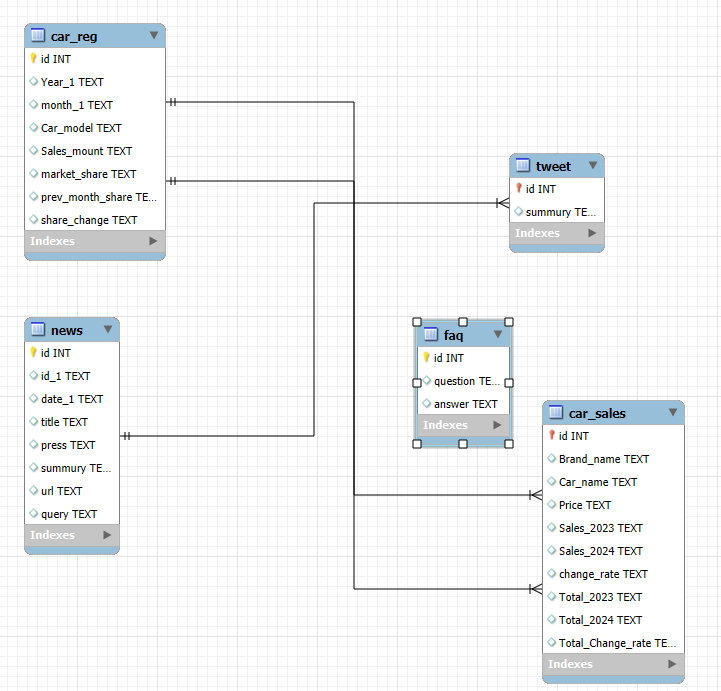

---

# 3. 연두색 번호판 시행 전후 슈퍼카 판매량/등록 수 변화

## 3-1. 고가 법인차 등록 흐름 및 시장 동향 

### 3-1-1. 연도별 법인 수입차 cc별 등록수 변화 추이 
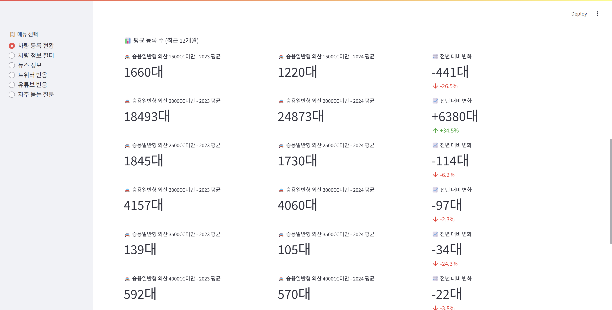

### 3-1-2. 법인차 관련 뉴스 
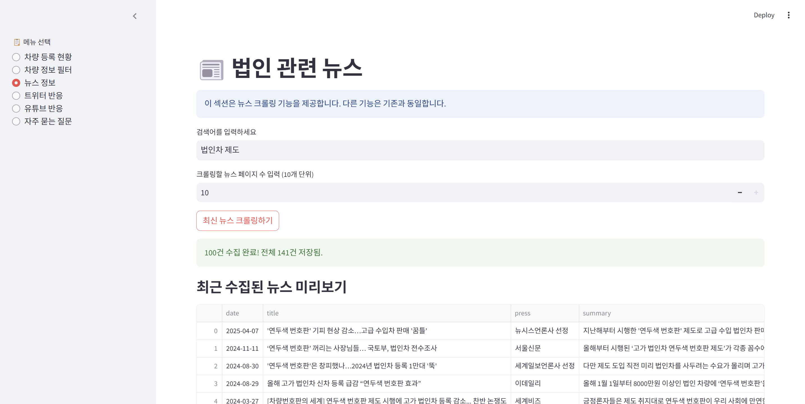
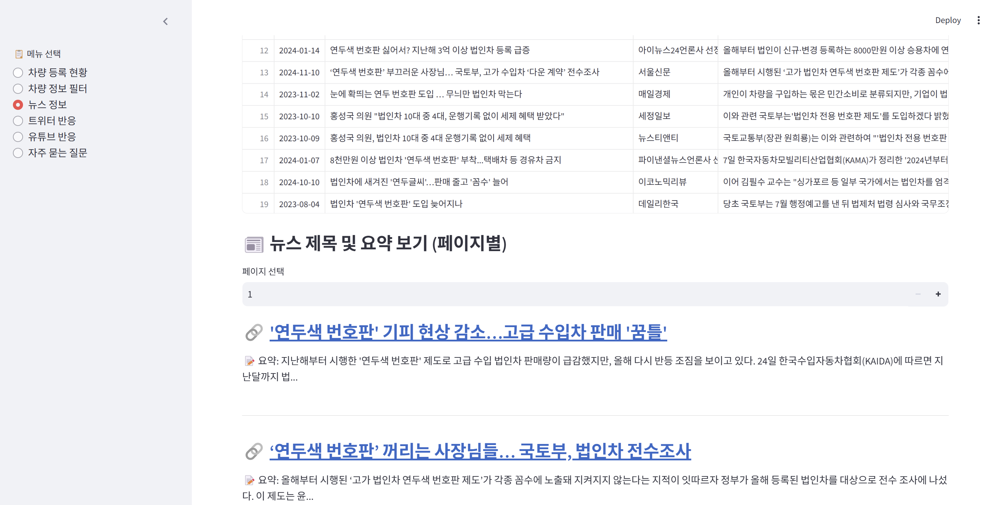

---

## 3-2. 정책 시행 전후 판매량 비교
### 3-2-1. 연도별 법인차 등록 대수 및 슈퍼카 판매 변화

**전년도(2023년)** 까지만 해도 억대 수입차 시장은 **호황**

>한국수입자동차협회(KAIDA)에 따르면 2023년 한 해 동안 1억 원 이상 수입차는 총 6만2,520대가 팔렸고, 이 중 약 65%가 법인차였다​
>특히 포르쉐, 벤틀리, 롤스로이스 등 슈퍼카 브랜드는 대부분이 법인 명의로 등록되는 구조였다.

📉 예시 그래프: 슈퍼카 (Porsche Panamera) 판매량 변화
> 
> 

## 3-2-2. 분석 브랜드 - 가장 큰 하락폭을 보인 브랜드 TOP 3
2024년 1월, 연두색 번호판 제도가 본격 시행되면서 분위기는 급변했다.

**출고가 8천만 원 이상 법인차**에 연두색 번호판 부착이 의무화되자, 시장은 즉각적으로 반응했다.

2024년 1~7월 기준 8000만원 이상 법인차 등록 대수는 2만7400대로 전년 동기 대비 -27.7% **감소**.
> 그 중 **슈퍼카 브랜드의 판매량 감소**는 더욱 두드러졌다.

| 순위 | 브랜드 | 판매 감소율       | 대표차종    |
|:------:|:-------------------:|:--------------:|:-------------:|
| 1위 | 맥라렌 | -85.0% | 아투라, 720S |
| 2위 | 벤틀리 | -65.0% | 컨티넨탈 GT, 벤테이가 |
| 3위 | 롤스로이스 | -44.4% | 고스트, 컬리넌 |

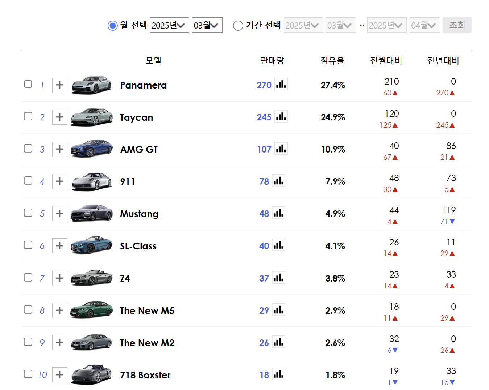
출처: 다나와 자동차 2025년 3월 수입 스포츠카 판매실적

---

## 3-3. 주요 브랜드별 및 시장 트렌드 변화 📉 

2024년 연두색 번호판 제도 시행 이후, 일부 슈퍼카 브랜드는 **판매량이 급감**하며 전략 조정을 시작했다.
>애스턴마틴은 전년 동기 대비 96.2%, 맥라렌은 85.0%, 벤틀리는 65.0% 감소하며 법인 수요 의존도가 컸던 브랜드들이 직접적인 타격
>각 브랜드 대응 전략: 애스턴마틴, 벤틀리 등은 신차 출시 및 마케팅 강화 시도.

- 법인 명의 구매 줄고 **개인 명의 고급차 구매 비중 증가** : 법인 대신 고소득 개인 고객 대상 마케팅 전환
> 대표적인 예시: 메르세데스 S-클래스 대신 제네시스 G90 수요 증가, 국산 고급차 소비 확대

---  

## 3-4. 부작용 및 회피 - 탈세, 절세 경로 등장 🔄  

⚠️ **다운계약서 작성**: 출고가를 할인으로 낮춰 연두색 기준(8000만원)을 피하는 방식

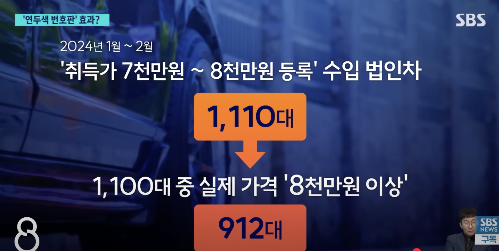
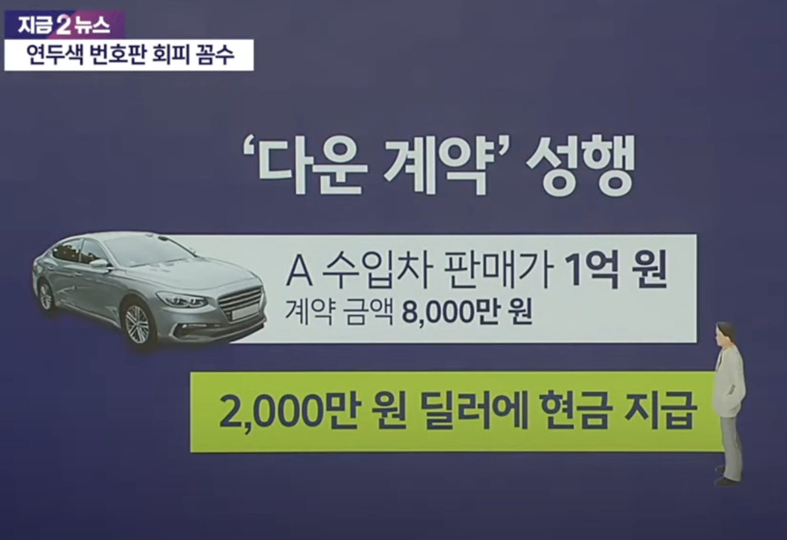

⚠️ **개인 리스 전환**: 법인 대신 개인 명의 리스로 전환하는 사례 증가

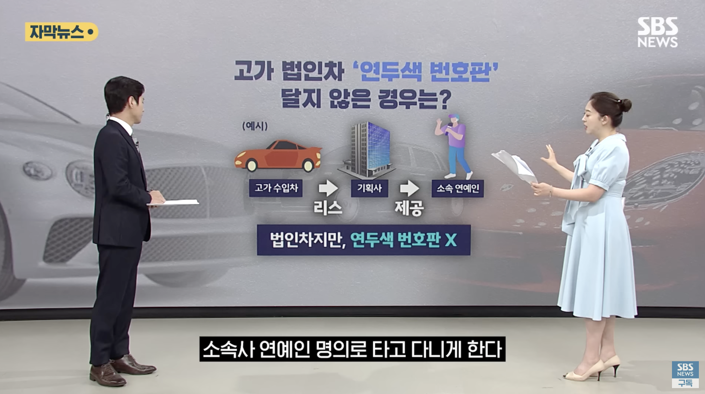

⚠️ **특수 계층 예외**: 대통령·국회의원·지방자치단체장 등의 차량은 예외 적용

⚠️ **기존 등록차량 예외**: 제도 시행 전 등록 차량은 그대로 유지 → 실효성 저하

⚠️ **역설적 현상**: “연두색 차가 더 많아졌다”는 인식 확산 → 오히려 ‘부의 상징’처럼 여겨지기도 함​

---

# 4. 사람들의 인식 및 반응 분석 

📌 수집 플랫폼
- **Youtube 영상 댓글**

- **News 댓글뉴스**

- **Twitter(X) 해시태그 및 키워드 기반 수집**

🔍 분석 방식

- **Python** 기반 크롤러로 유튜브 댓글 약 600개 수집

- **Selenium**으로 트위터 크롤링

- **Streamlit**을 통해 검색 필터링 및 워드클라우드 분석

- 주요 키워드 빈도 및 정성적 반응 분류

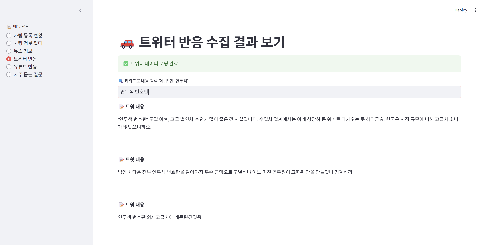

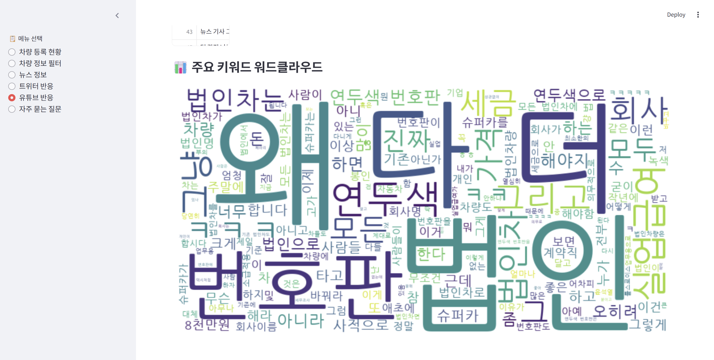

### 4-1. 긍정적 인식✅ 
“이제 법인차인지 눈에 보인다”

“편법 줄어들 듯, 공정해졌다”

“연두색 번호판이라면 누구나 알아보니 위화감 해소에 효과 있음”

> 정책 취지에 대한 이해와 지지는 높음. ‘차별’보다는 **‘식별’ 기능**에 의미를 부여.

### 4-2. 부정적 인식 ❌ 
“법인차가 죄냐”, “실질적 법인 오너들이 개인이랑 다를 게 없음”

“왜 8천만 원 기준인가, 왜 관용차·정치인은 예외인가”

“꼼수 막는 척하지만 다 피해간다”

> 적용 기준과 예외 항목에 대한 형평성 논란. 일부는 **‘낙인 효과’**에 대한 불만도 표출.

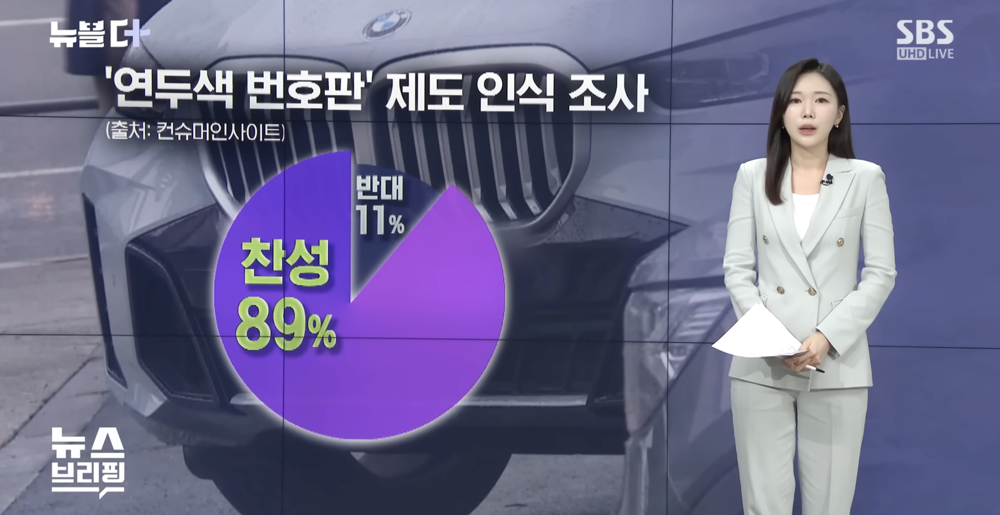

---

# 5. 결론 

## 5-1. 정책 효과 분석

### 법인 슈퍼카 등록 감소 📉 

2024년 1월 연두색 번호판 제도 시행 이후, 억대 슈퍼카의 법인 등록 대수는 눈에 띄게 **감소**했다.

대표적으로 벤틀리, 맥라렌, 롤스로이스 등 법인 비중이 높았던 브랜드들의 신규 등록이 40~90% 수준까지 감소했다​

>법인 명의로 차량을 구매할 때 누릴 수 있었던 부가세 환급, 감가상각 통한 비용 처리, 법인세 절감 효과 등이 줄어들었기 때문

>예: 1억 원 차량 → 부가세 1,000만 원 환급 + 운영비 연 수백만 원 비용처리

제도 시행 이후 해당 혜택을 받지 못하게 되어 **세수 회복 가능성도 제기**됨

>다만 세수 효과에 대한 명확한 정부 공식 수치는 현재로선 확인되지 않음

---

## 5-2. 개선 방향 및 예상되는 효과

연두색 번호판 제도는 첫 시도라는 점에서 의미가 있으나, **법적 허점**과 **회피 수단**이 존재한다는 지적이 이어지고 있다.

특히 출고가 기준 회피 **(다운계약서)**, **단기 렌트 우회**, **관용차·정치인 차량 예외**, 등의 사례는 실효성에 의문을 제기하게 만든다.

### 5-2-1. 제도 실효성 확보를 위한 개선 제안

|제안 항목|내용|
|:------:|:-------------------------------------------:|
|운행일지 의무화|실제 운행 목적 구분을 위한 운행기록 관리 필요|
|출고가 기준 감독 강화|다운계약 등 회피 수단 방지 위한 출고가 등록관리 정비|
|1년 이상 리스·렌트 통합 감시	"1년 이상이면 부착 대상"|국세청과 정보 연계 강화|
|세제 혜택 제한 상한선 도입|고가 차량 세금 환급 상한선 설정|
|용도 중심 기준 재설계|단순 가격 기준보다 ‘업무용도 기준’ 중심으로 재정비|

📌 국토부는 연두색 번호판 대상 차량 정보를 국세청과 주기적으로 공유하고, 세금 탈루 대응체계를 운영 중

### 5-2-2. 제언
연두색 번호판 제도는 법인 자산의 사적 유용 문제를 해결하기 위한 초기 단계 정책이다.

중장기적으로는 가격이 아닌 **'용도 기준'** 중심의 정책 설계, 우회 등록 수단 차단, 실사용자 추적 체계 구축 등 보다 **정교한 제도 개선**이 필요하다.

이를 통해 단순한 낙인 정책이 아니라, **공정한 법인차 제도 운영**과 **조세 정의 실현**으로 이어져야 할 것이다.

---

# 6. FAQ 

- 연두색 번호판은 어떤 차량에 부착되나요?
  
- 법인차량에 연두색 번호판을 도입한 목적은 무엇인가요?

- 법인차로 등록할 때 취득가를 낮춰서 신고하면 어떻게 되나요?

- 연두색 번호판을 단 법인차량을 사적으로 사용할 경우 어떻게 되나요?

- 정책 시행 이후 어떤 변화가 있었나요?

- 연두색 번호판 차량의 용도 외 사용을 신고하면 포상금이 있나요?

- 법인차량 연두색 번호판을 달지 않으면 과태료가 부과되나요?

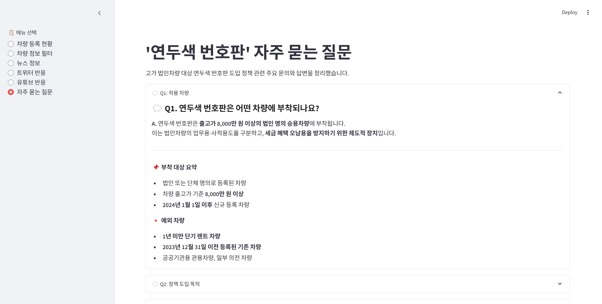

끝.
